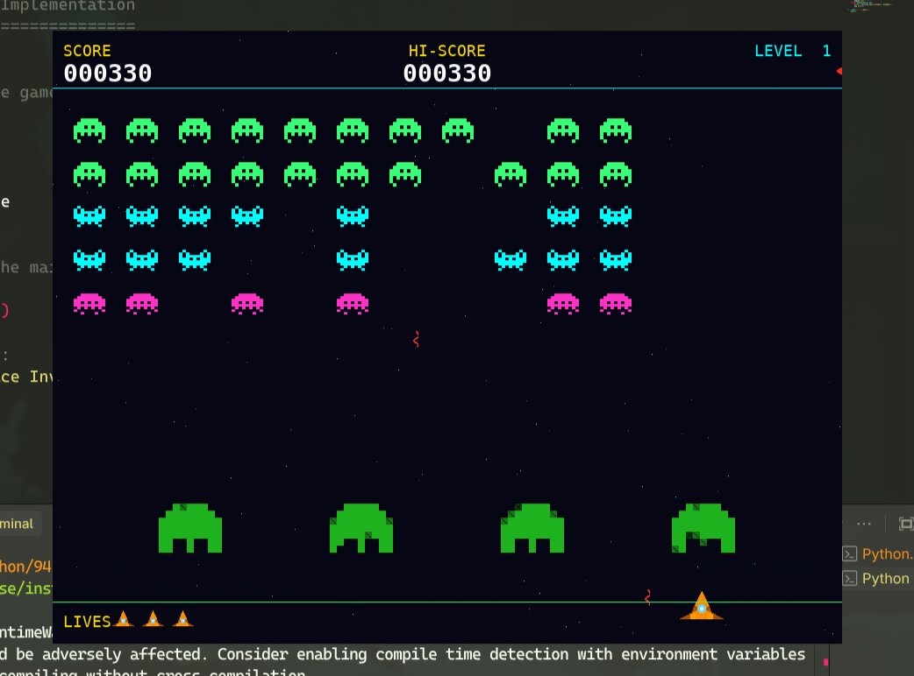

# Space Invaders

A production-grade Python/Pygame implementation of the classic arcade shooter, built with a strong emphasis on clean architecture, object-oriented design, and maintainability.

## 📸 Game Preview



## What It Does & Who It Is For
This project provides a robust, cross-platform local clone of *Space Invaders*. It is designed for developers who want to study game loop mechanics, Pygame optimizations, and decoupled object-oriented architecture in Python.

## Core Features
- **Dynamic Difficulty Scaling**: Enemy fleet speed scales non-linearly based on the remaining alien count.
- **Destructible Environments**: Player bunkers take localized damage based on projectile intersection geometry.
- **Entity State Machines**: Centralized state management for game phases (Title, Playing, Game Over) and enemy behavior.
- **Procedural VFX**: Visual effects like starfields and explosions are generated procedurally without external image dependencies.
- **Deterministic Loop**: Input handling and physics operate independently of rendering frame rates.

## Technology Stack
- **Language**: Python 3.9+
- **Graphics Framework**: Pygame 2.0+
- **Tooling**: Pytest (Unit Testing), Black/Isort (Formatting), Mypy (Type checking), Pylint (Linting)

## Architecture Overview
The application uses a decoupled Object-Oriented approach:
- **`engine.py` (GameEngine)**: The central orchestrator. Maintains the game loop, limiting updates using `pygame.time.Clock.tick` while passing delta-time (`dt`) for deterministic physics.
- **`entities.py` (Entity Base)**: Defines the core logic for the Player, Aliens, UFOs, and Projectiles. Entities own their logical state but delegate rendering.
- **`fleet.py` (AlienFleet)**: A state machine governing the collective movement of the alien armada (Horizontal shift, Edge check, Vertical drop).
- **`bunker.py` (Bunker)**: Manages binary occupancy grids representing destructible tiles.

## Engineering Decisions & Tradeoffs

### 1. Two-Phase Collision Detection
Collision detection relies on a Two-Phase Bounding-Box (AABB) approach. 
- **Decision**: A broad phase categorizes active projectiles, followed by a narrow phase using `pygame.Rect.colliderect()`.
- **Tradeoff**: While an ECS (Entity Component System) or spatial hash grid scales better for thousands of entities, AABB is $O(1)$ per check and perfectly optimized for the low entity count (<100) of this game, avoiding over-engineering.

### 2. Input Polling vs Event Callbacks
- **Decision**: Key-state polling (toggling boolean flags on `KEYDOWN` / `KEYUP`) rather than relying on OS-level event callbacks.
- **Tradeoff**: Bypasses the OS-level key repeat delay (which introduces artificial latency), allowing simultaneous movement and firing. However, this means input state is inextricably tied to the game tick loop.

### 3. Procedural Assets
- **Decision**: Sprites and VFX are built procedurally at runtime using Pygame shape generation rather than loading `.png` files.
- **Tradeoff**: Dramatically reduces the repository size and simplifies installation, but limits the artistic complexity of the sprites to pixel-art geometries.

## Local Setup & Execution

### Prerequisites
- Python 3.9 or higher
- Git

### Installation
Clone the repository and install the development dependencies:
```bash
git clone https://github.com/azeemsher788/space-invaders-oop.git
cd space-invaders-oop
pip install -e .[dev]
```

### Running the Game
Launch the entry script:
```bash
make run
# or run directly:
python main.py
```

### Controls
* **Move**: `Left / Right Arrows` or `A / D`
* **Fire**: `Spacebar` or `W` or `Up Arrow`
* **Pause**: `P`
* **Select**: `Enter`

## Development & Testing
The project includes a `Makefile` and `pyproject.toml` for standard workflows.
- **Format Code**: `make format`
- **Lint Code**: `make lint` (Runs `pylint` and `mypy` strict)
- **Run Tests**: `make test` (Runs `pytest` unit test suite)

## Known Limitations & Future Improvements
- **No Sound System**: The game currently lacks SFX or music. Integrating Pygame's `mixer` module is planned.
- **State Persistence**: High scores are lost when the game closes. A lightweight `sqlite3` persistence layer would solve this.
